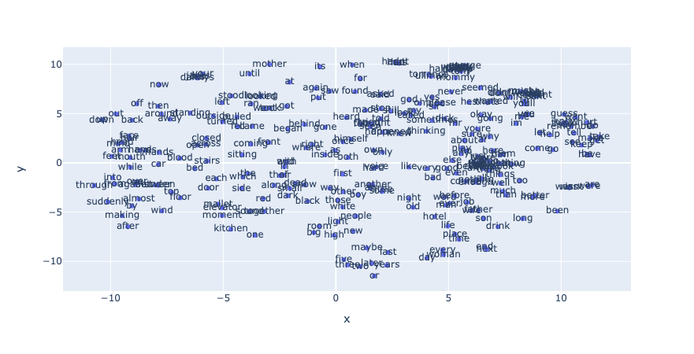
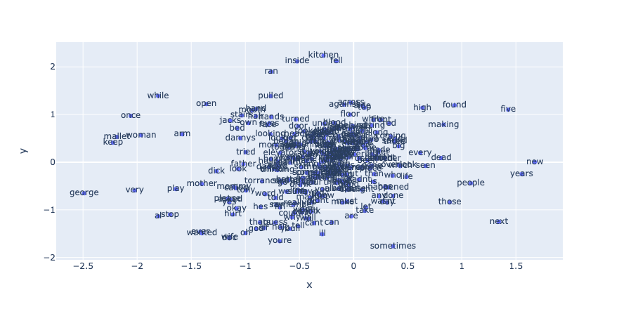
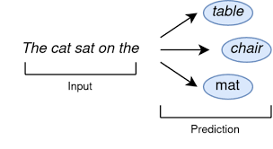

# NLP-projects


Welcome to this repository! :octocat:

Here you will find some interest projects that I have made during my studies in NLP field.

## Summary from each project

### First challange

On this first challange you will find how to do a vectorization without any special library, just working with Numpy. The three vectorization methods that were applied on this notebook are OneHotEncoding, Frecuency vectors and TF-IDF.

At the end there is a comparison between this vectorization method applied to a small corpus.

### Second challange

On the second challange you will find a chatbot for "emergency calls". Al text entry was preprocessed with spacy using the spanish pipeline. After that, TF-IDF was implemented as a vectorization technique and a small neural network was built to solve this multiclassification problem.

here is part of the output from the bot.

```
hola
Q: hola
1/1 [==============================] - 0s 26ms/step
BOT: Bienvenido a MedicOnline. ¿En que te puedo ayudar?
tengo alguna cita programada?
Q: tengo alguna cita programada?
1/1 [==============================] - 0s 27ms/step
BOT: No se encontraron citas programadas
me gustaría programar una cita
Q: me gustaría programar una cita
1/1 [==============================] - 0s 33ms/step
BOT: ¿Para cuando quieres tu cita?
realmente tengo una urgencia
Q: realmente tengo una urgencia
1/1 [==============================] - 0s 29ms/step
BOT: Hola! Bienvinido a MedicOnline. ¿En que te puedo ayudar?
tengo una emergencia
Q: tengo una emergencia
1/1 [==============================] - 0s 24ms/step
BOT: Envíe su ubicación y una ambulancia andará en camino
me puedo contactar con un doctor
Q: me puedo contactar con un doctor
1/1 [==============================] - 0s 26ms/step
BOT: Enseguida lo derivaremos con un doctor de urgencias...
gracias
```
### Third challange

The third challange is related to Word2Vec using two algoritms (CBOW and Skip-gram). Furthermore, in this project we build our custome embedding with Gensim. In this way the following example is the word relationship using as a corpus a book from Stephen King "The Shining".

CBOW



Skip-gram



### Fourth challange

Fourth challange is about predicting the next word using neural networks and LSTM architecture. Futhermore, we explore the use of Greedy Search and Beam Search to find the next word.



### Fifth challange
